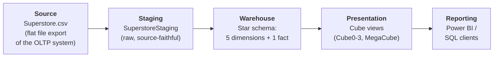
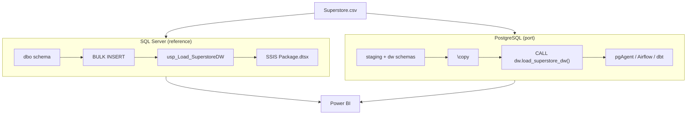

# Architecture

## Layered architecture (bird's‑eye view)

The warehouse follows a proven, easy‑to‑explain **four‑layer** flow. Data moves
left to right; each layer has one job.



| Layer | Object(s) | Responsibility |
|-------|-----------|----------------|
| **Source** | `Superstore.csv` | System‑of‑record extract. Read‑only to us. |
| **Staging** | `SuperstoreStaging` | Land the raw file 1:1 with **minimal transformation**. Preserves source fidelity; a safe re‑run point. |
| **Warehouse** | `dimDate, dimCustomer, dimProduct, dimGeog, dimShipMode, FACTOrderItem` | The conformed **star schema**. Surrogate keys assigned here; this is the single version of the truth. |
| **Presentation** | `Cube0–3, MegaCube, vCustomerSegment` | Pre‑joined, pre‑aggregated **views** that hide the star‑join from report authors. |
| **Reporting** | Power BI, SSMS, `psql` | Consumption. No business logic lives here. |

## Why two databases (OLAP vs OLTP)?

| | OLTP (day‑to‑day) | OLAP (this warehouse) |
|--|--|--|
| Optimised for | writes (INSERT/UPDATE/DELETE) | reads (SELECT/reporting) |
| Normalisation | 3NF, no redundancy | denormalised star, some redundancy |
| Indexing | minimal (writes stay fast) | many (reads stay fast) |
| Read/write ratio | ~100–10,000 : 1 | ~1,000,000,000 : 1 |

Separating them means analytical workloads never compete with transactional
ones. (Full notes: [`/archive/Day 1/notes`](../archive/Day%201/notes).)

## Data lineage

Every fact measure can be traced back to its source column:

```
Superstore.csv
  → SuperstoreStaging (raw columns)
      → dimCustomer / dimProduct / dimGeog / dimShipMode / dimDate   (DISTINCT natural keys → surrogate keys)
      → FACTOrderItem   (staging rows joined to each dim on the natural key to pick up the surrogate key)
          → Cube views  (star joins + GROUP BY)
              → Power BI
```

- **Natural keys** (from source): `Customer_ID`, `Product_ID`, `Ship_Mode`,
  `Postal_Code + City`, `Order_Date`.
- **Surrogate keys** (generated here): `Customer_SK`, `Product_SK`,
  `ShipMode_SK`, `Geog_SK`, `Date_SK`, plus the fact's own `Fact_SK`.

## Keys & integrity

- **Primary keys** — every table's surrogate key (`*_SK`) is its PK.
- **Surrogate keys** — meaningless integers (`BIGINT IDENTITY` / `GENERATED
  ALWAYS AS IDENTITY`) that decouple the warehouse from volatile source keys and
  are the foundation for slowly‑changing dimensions.
- **Foreign keys** — `FACTOrderItem` references all five dimensions, enforcing
  that no fact row can point at a missing dimension member.
- **Degenerate dimensions** — `Row_Id` and `Order_Id` live on the fact with no
  dimension table of their own (they identify the transaction/order directly).

## Physical / technology view



See [`dimensional-model.md`](dimensional-model.md) for the star schema detail and
[`etl-process.md`](etl-process.md) for the load mechanics.
