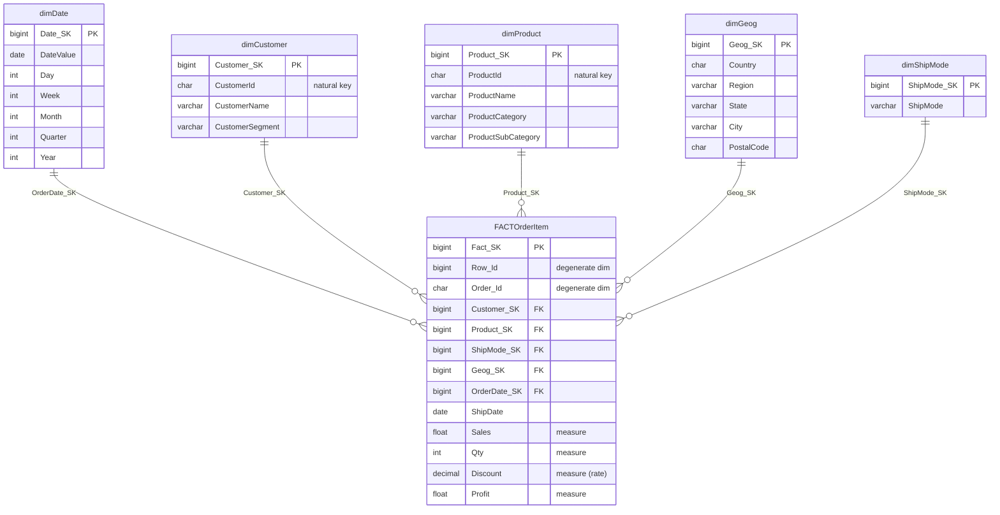

# Dimensional Model (Kimball Star Schema)

## The star

One central **fact** table surrounded by five **dimension** tables — the classic
Kimball star. Reports work by joining the fact to whichever dimensions the
question needs and aggregating the measures.

## Fact table: `FACTOrderItem`

- **Grain (the most important design decision):** **one row per order line
  item.** A single order (`Order_Id`) with three products produces three fact
  rows. The grain is declared once and everything else follows from it.
- **Type:** transactional fact (each row = one business event).
- **Measures:**

  | Measure | Additive? | Notes |
  |---------|-----------|-------|
  | `Sales` | ✅ fully additive | sum across any dimension |
  | `Qty` | ✅ fully additive | units sold |
  | `Profit` | ✅ fully additive | can be negative |
  | `Discount` | ⚠️ non‑additive | it's a **rate** (0–1); **average** it, never sum |

- **Degenerate dimensions:** `Row_Id`, `Order_Id` — order/line identifiers kept
  on the fact with no separate table.

## Dimensions

| Dimension | Grain (one row per…) | Natural key | Key attributes |
|-----------|----------------------|-------------|----------------|
| `dimDate` | calendar day | `DateValue` | Day, Week, Month, Quarter, Year |
| `dimCustomer` | customer | `CustomerId` | CustomerName, **CustomerSegment** |
| `dimProduct` | product | `ProductId (+ProductName)` | Category, Sub‑Category |
| `dimGeog` | location | `PostalCode + City` | Country, Region, State, City |
| `dimShipMode` | shipping method | `ShipMode` | — |

### Design notes worth calling out

- **Segment is denormalised into `dimCustomer`.** In strict 3NF, customer
  segment might be its own table. Kimball deliberately folds it into the customer
  dimension so reports don't need an extra join — a textbook OLAP‑over‑3NF
  trade‑off. This is called out in the original build notes and preserved here.
- **`dimGeog` is a combined geography dimension** (country→region→state→
  city→postcode in one table) rather than a snowflake. Fewer joins, faster reads.
- **`dimDate` is a generated calendar**, not derived from the data's distinct
  dates. Generating every day in the range means reports never have gaps and can
  filter/scan by date attributes using an index instead of applying functions to
  the fact.

## Slowly Changing Dimensions (SCD)

The current build treats dimensions as **SCD Type 1** (overwrite): a full
refresh rebuilds them each run, so the latest source values win and no history
is kept. The surrogate‑key design is what makes upgrading to **SCD Type 2**
(track history with `effective_date` / `end_date` / `current_flag`) a
non‑breaking change later — the fact keeps pointing at surrogate keys regardless.
See [`etl-process.md`](etl-process.md#slowly-changing-dimensions) for the Type‑2
pattern.

## Sample business questions the model answers

From [`/archive/Day 5/Task.md`](../archive/Day%205/Task.md):

- Total sales by **region** → `Cube1` / join fact→`dimGeog`.
- Total sales by **product category** → `Cube3`.
- **Yearly** sales by **customer segment** → `Cube2`.
- **Top 5 months** by sales → aggregate fact→`dimDate`.
- All of the above from a single object → **`MegaCube`**.
